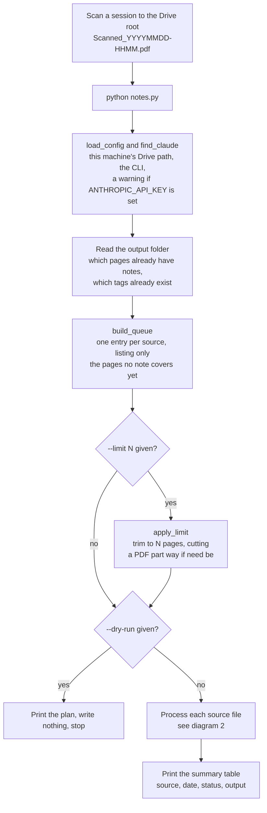
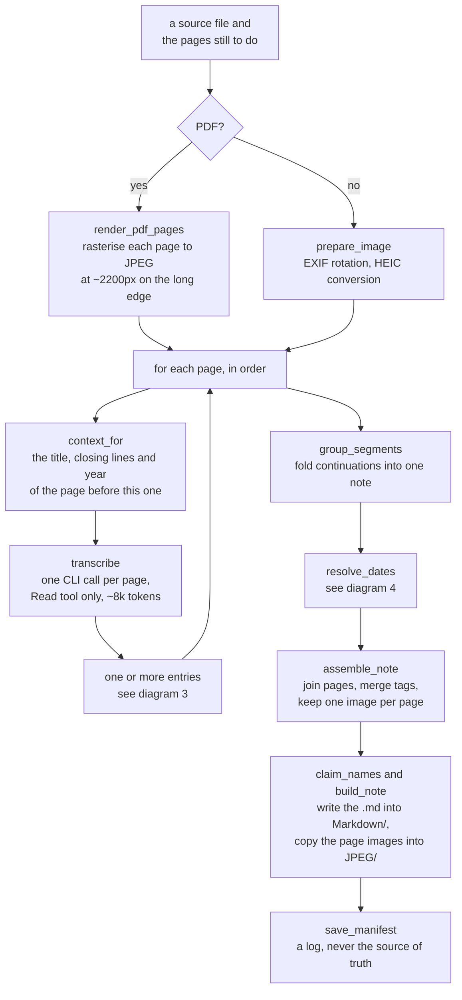
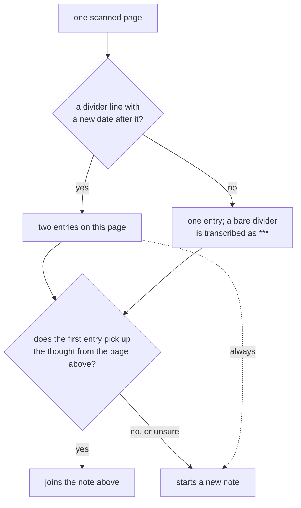
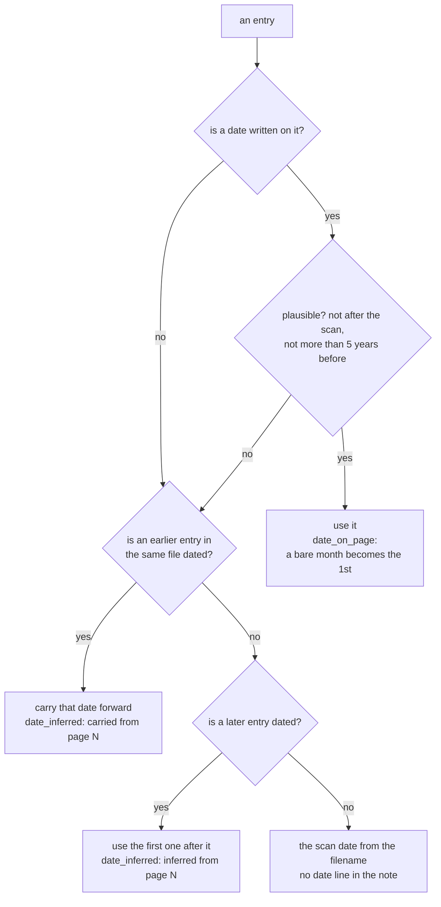

# Workflow

What actually happens between a scanned page and a note on disk. The prose lives
in [README.md](README.md); this file is the map.

Diagrams are [Mermaid](https://mermaid.js.org/) inside fenced blocks: plain text,
so a change shows up as a readable diff, and GitHub, Obsidian and most editors
render it without a build step.

---

## 1. A run, end to end



Nothing is ever deleted or moved. The original scan stays in the Drive root
until you clear it out by hand.

---

## 2. One source file, page by page



A page that fails is logged and skipped; the rest of the file carries on. The
notes for a file are written once all its queued pages are done, so stopping
mid-file loses at most that one file's transcriptions — and the next run picks
those pages back up.

---

## 3. Which note does a page belong to?



The bias is deliberate: unsure means *new note*. One reflection split across two
files is obvious the moment you read them; two reflections welded into one file
is the mistake you notice months later, if ever.

---

## 4. Which date does a note get?



Carrying forward rests on one assumption: the pages of a single scan are in the
order they were written. That holds within a file, so it is never applied across
files. Dates that run backwards inside one file are used as written and flagged
in the run summary, because that is the assumption breaking.

An interrupted run reads the date it was carrying back out of the notes it
already wrote — `carry_seed` — so a run split by `--limit` dates its notes
exactly as an uninterrupted one would.

---

## Where each step lives

Everything is in [notes.py](notes.py), in roughly this order.

| stage | function |
|---|---|
| Per-machine paths, CLI location | `load_config`, `find_claude`, `check_billing` |
| Date from the scan filename | `scan_date_from_name` |
| Validate a date the model read | `parse_page_date` |
| Output filenames, collision suffixes | `slugify`, `image_names_for`, `claim_names` |
| Moving an older flat-layout archive into `Markdown/`/`JPEG/` | `migrate_flat_layout` |
| Run log, read and merged before every write | `load_manifest`, `save_manifest`, `pages_from_manifest` |
| What is already done, and the date to resume with | `pages_already_written`, `carry_seed` |
| Page images in, whatever the source | `wait_until_stable`, `prepare_image`, `render_pdf_pages`, `prepare_pages` |
| **The only provider-specific code** | `SCHEMA`, `SYSTEM_PROMPT`, `build_prompt`, `transcribe` |
| Pages into reflections | `context_for`, `group_segments`, `resolve_dates` |
| Reflections into files | `join_markdown`, `assemble_note`, `build_note` |
| Tag vocabulary fed back to the model | `collect_known_tags` |
| Queue, page budget, the run itself | `build_queue`, `apply_limit`, `main` |

Swapping model provider means rewriting `transcribe` and nothing else.

---

## What ends up on disk

```
My Drive/
├── Scanned_20260819-1500.pdf              the original, untouched
└── 02_Areas/Personal/Reflection AI automated/
    ├── Markdown/
    │   ├── 2026-07-26_relaxed-productivity.md      one reflection, pages 1-3
    │   └── 2026-08-02_reading-notes.md             next reflection, page 4
    ├── JPEG/
    │   ├── 2026-07-26_relaxed-productivity.jpg     page 1
    │   ├── 2026-07-26_relaxed-productivity_p2.jpg  page 2
    │   ├── 2026-07-26_relaxed-productivity_p3.jpg  page 3
    │   └── 2026-08-02_reading-notes.jpg
    └── _manifest.json                          the run log, one level up
```

A note and its images are always in these two subfolders, never loose in the
folder above them. If an older run left files loose there (from before this
split existed), the next run moves them into `Markdown/`/`JPEG/` itself, before
it looks at what's already done — `migrate_flat_layout`, one-time and harmless
to run more than once.

Because every note keeps an image of every page it covers, the whole archive can
be re-transcribed against a better model later: delete the manifest, or run with
`--force`.

---

## Keeping this file current

This document is part of the change, not a follow-up to it. When `notes.py`
changes, update it in the same commit:

- a new or renamed function → the table in **Where each step lives**
- a change to how pages are grouped into reflections → **diagram 3** and the
  splitting rules in `build_prompt`
- a change to how a date is chosen → **diagram 4** and the date rules in
  [README.md](README.md), which must not contradict each other
- a new input format, flag, or output file → **diagram 1**, **diagram 2**, or
  **What ends up on disk**

If a change makes a diagram wrong and there is no time to redraw it, delete the
diagram rather than leave it lying. A stale map is worse than no map.
